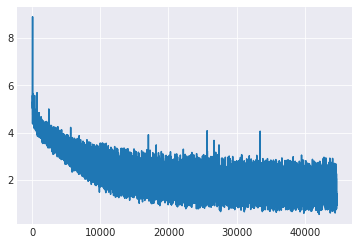

my code is inspired by https://github.com/ibab/tensorflow-wavenet
and https://github.com/soobinseo/wavenet

# Using pyTorch to implement the WaveNet for vocal separation
# remove the background music from songs

  - vstrain.ipynb
     - all the main code is in this file
  - plotLoss.ipynb
    - when you training the model, you can use this file to visualize model's loss trend 
    - babysit the model
  - playTorch.ipynb
    - just begin to learn pytorch, try some functions
  - vsFromTwoFile.ipynb
    - ongoing task, use other method to remove the music from songs
  - vsCorpus
    - training set, testing set and some results 
 - lossRecord
   - model will write the loss file to this folder

# Dataset
 - origin_mix.wav(train)
 - origin_vocal.wav(label)
 - pred_mix.wav(test)

# Result
- bestResultonTestingSet.wav
- bestResultonTrainingSet.wav
- bestResultonValidation.wav
- there are still some noise and a little music on audios on validation and testing set

# Loss
 - best loss: around 1

# hyper-parameters
 - sampleSize=32000#the length of the sample size
 - sample_rate=16000#the length of audio for one second
 - quantization_channels=256 #discretize the value to 256 numbers
 - dilations=[2**i for i in range(9)]*5
 - residualDim=128
 - skipDim=512
 - filterSize=3
 
# Notice
 - if i set residual channel to 256, the loss will stuck into 4.5,(actually, loss returns from 3.5)
 - if you only padding zero on the two side of the audio, which is slightly worse than the result which you padding whenever you use cnn. I still do not understand

# ToDo
 - better learning rate decay strategy, speed up the training process.
 - bigger dataset
 

